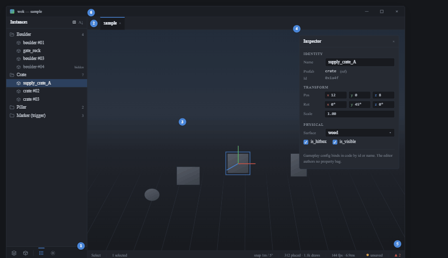
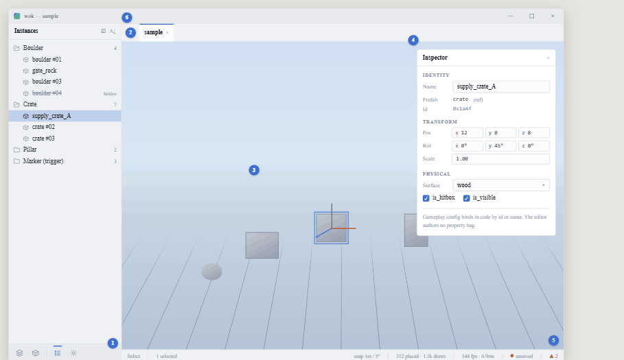

# View 1 — Scene view: selection + floating inspector

**Roadmap 3b · viewport context.** Shared rules, tokens, and the shell layout
live in [../README.md](../README.md). Colours are `theme::palette(ctx)` fields.

## Purpose

The spatial hub. Select and transform prefab instances in the 3D viewport; the
inspector appears on selection.

## Layout

Full-height nav (Instances tree active — see [view 2](2-nav-panel.md)) | view
column: tab bar, a transparent `CentralPanel` (wok-render draws the 3D), the
view-column status bar.

## Components

- **Viewport** — a transparent egui `CentralPanel`; wok-render paints behind it.
  Left-click casts a pick ray (reuse the existing `editor_rect`) →
  `Action::Select(id)`. Selection outline + the 3-axis move gizmo are drawn by
  **wok-render in 3D**, not egui. Drag-move rides the gizmo.
- **Floating inspector** — `egui::Window`, clipped to the editor area, present
  **only** when the selection is non-empty. Reads the selection set. Sections, in
  order:
  - **IDENTITY** — Name (`TextEdit`, emits rename), Prefab (read-only ref label),
    Id (read-only `0x…` mono).
  - **TRANSFORM** — Pos / Rot / Scale as `DragValue` rows; X/Y/Z tinted with the
    axis colours (X `#d8534a`, Y `#5bbd5b`, Z `#4a86d8`). Each commit emits a
    transform action.
  - **PHYSICAL** — Surface (`ComboBox`), `is_hitbox` + `is_visible` checkboxes.
  - Closes with the dim boundary line, **verbatim**: *"Gameplay config binds in
    code by id or name. The editor authors no property bag."*
- **Status bar** — left: mode (`Select`) · selection count; right: snap setting ·
  placed/draw counts · fps/frame-time · save dot · integrity count. Section labels
  `text_dim`, values `text`. The **save dot** is the Save click target; the
  **integrity count** opens the Integrity view.

## Actions

- `Action::Select(id)` on pick.
- Transform / identity / physical mutations through `action::handle`.
- Field edits are focus-gated (a focused field types; otherwise keys drive the
  editor).

## Build notes

This view shares its picking + gizmo + floating-inspector core with the Prefab
editor (view 5). Lift the proven picking, rotation handling, and inspector code
from the prior editor's git history.
