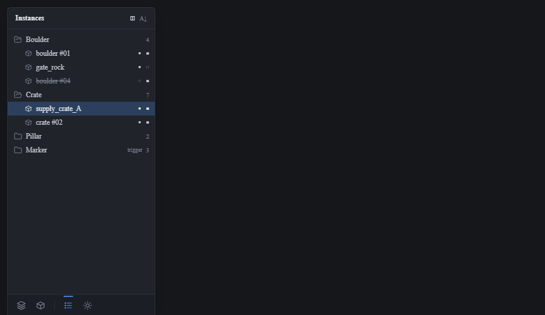
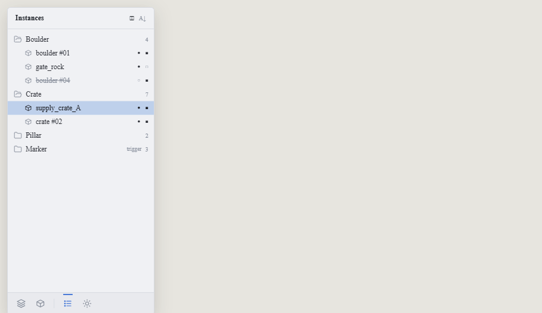

# View 2 — Navigation panel: bottom icon bar + Instances tree

**Roadmap 3b.** Shared rules and tokens: [../README.md](../README.md).

## Purpose

Switch the panel's view; browse and select the open scene's instances.

## The bottom icon bar (replaces nested tab tiers)

A Zed-style icon row at the panel **foot** (`surface`, ~38-40px, top hairline). A
vertical divider splits two scope groups, left to right:

- **Project group** — Scenes (layers icon), Prefabs (box icon). Same whichever
  scene is open.
- **this-scene group** — Instances (list icon), Lighting (sun icon). Bound to the
  open scene.

The active icon gets a 2px accent top-line + `accent` tint; the rest `text_dim`.
Emits a new `Action::SelectNavView`. Reads `model.shell` + content.

## Panel header

A single top row naming the active view (`text_bright`, weight 600) with its one
contextual control on the right (here a group-by-prefab / flat A–Z toggle). The
body below is **wholly** the active view, so the tree keeps the height.

## Instances tree (Zed file-tree styling — match this)

- **Group rows** (by prefab): disclosure chevron, a **folder icon**, the prefab
  name, a count on the right.
- **Instance rows**: indented (~30px), a **type icon** (cube for placements,
  dashed box for trigger/region volumes), then the author name or `prefab #id`.
- **Full-bleed row highlight** for selection (no inset/rounded pill) — the
  accent-at-30% fill spans the full panel width. Rows tight (~24-25px).
- Hidden instances render dim with strikethrough.
- Inline state dots on the right: filled dot = `is_visible` (hollow = hidden),
  filled square = `is_hitbox` (dim = off).

## CC skeleton

A recursive row enum (`Group { … } | Instance { id, … }`), selection by id
(bidirectional with the viewport), two render orders behind a sort flag
(group-by-prefab vs flat A–Z). Toggle dots emit `Action::SetVisible` /
`Action::SetHitbox`.

## Actions

`Action::SelectNavView`, `Action::Select(id)`, `Action::SetVisible`,
`Action::SetHitbox` — all through `action::handle`.
