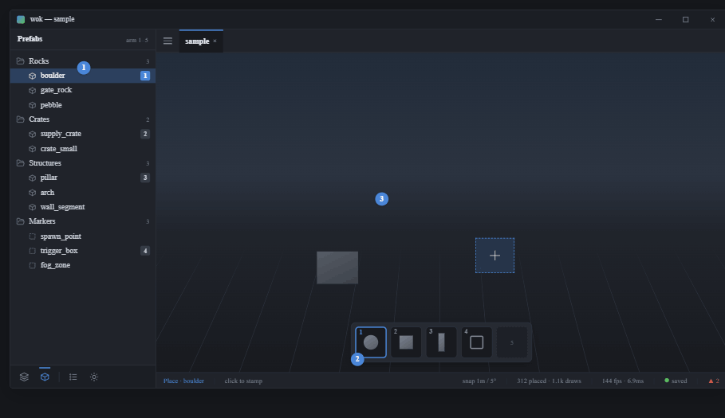
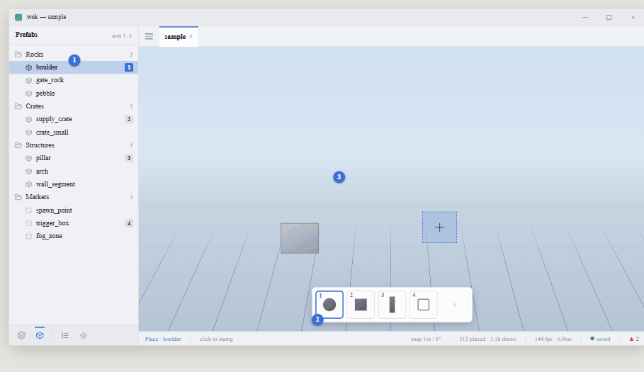

# View 3 — Place mode: the stamp hotbar

**Roadmap step 4.** Shared rules and tokens: [../README.md](../README.md).

## Purpose

Stamp armed prefabs onto the scene.

## Place mode = the Prefabs nav view is open

No mode key. With Prefabs active a left-click stamps the armed prefab; otherwise
left-click selects. The armed set is scene-context model state (the Prefabs view
edits it; persists when the panel hides). Number row 1-5 picks the active stamp
**only** while in place mode.

## Components

- **Prefabs nav view** — the armable list; each row a number badge (1-5) + name;
  armed row highlighted full-bleed accent.
- **Hotbar** — an in-viewport overlay (`egui::Area`, **not** chrome), centered at
  the bottom: five 52px slots, number-row keybind in the corner, armed slot
  ringed in `accent`. Shown only in place mode (the number row is free
  elsewhere).
- **Ghost stamp** — a dashed-accent preview snapped to the 1m grid under the
  cursor (drawn by wok-render). Left-click emits
  `Action::Place(prefab, transform)`.
- **Status bar** — left shows `Place · {prefab}` in accent + `click to stamp`;
  snap / save / counts flip live.

## Actions

`Action::Place(prefab, transform)` on click; arming the hotbar slot mutates
scene-context model state through `action::handle`.
