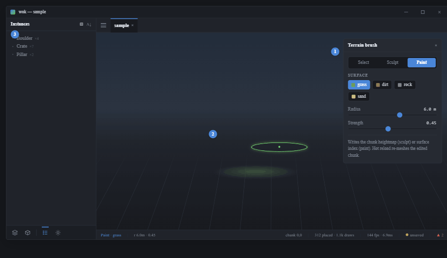
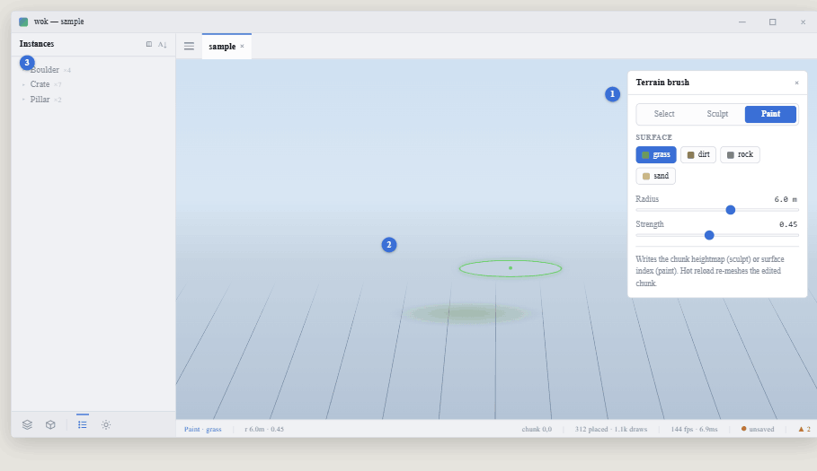

# View 4 — Terrain: sculpt + paint

**Roadmap step 5.** Shared rules and tokens: [../README.md](../README.md).

## Purpose

Shape and surface the ground. **A tool MODE of the Scene view, not a tab** — a
level is built holistically, so terrain shares the Scene view's viewport, camera,
and chunk.

## Components

- **Segmented tool control** in the floating panel: Select | Sculpt | Paint. Only
  the active tool's controls show.
- **Brush panel** (`egui::Window`) — surface swatches (grass / dirt / rock /
  sand) for paint; Radius + Strength `Slider`s; sub-tools for sculpt (raise /
  lower / smooth / flatten).
- **Brush ring** — a ground-projected ring at the cursor (wok-render debug
  lines), not egui.
- The Instances list in the nav **dims** (not gone) so focus is the ground.
- **Status bar** — `Paint · grass` (or `Sculpt · raise`) + `r {radius} ·
  {strength}` + the active chunk.

## Behaviour & actions

Drag to apply. Sculpt writes the chunk heightmap (`{cx}_{cy}.heightmap.bin`);
paint writes the per-vertex surface index. Both flow through `action::handle`;
the file watcher re-meshes the edited chunk (hot reload).
