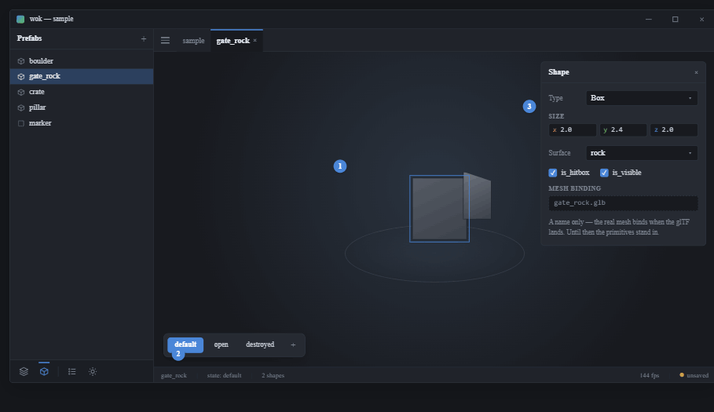
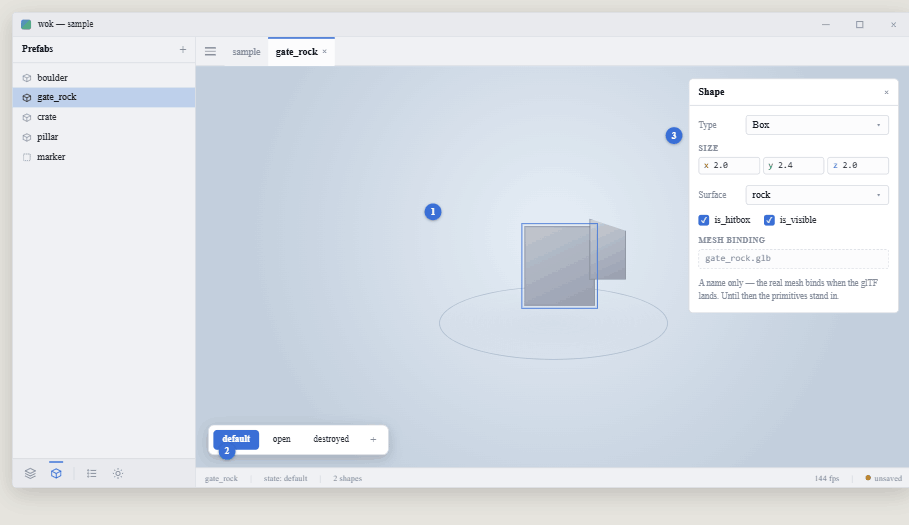

# View 5 — Prefab editor: shapes + named states

**Roadmap step 6 · viewport context.** Shared rules and tokens:
[../README.md](../README.md).

## Purpose

Compose one prefab in isolation from primitive shapes.

## Components

- **Prefabs nav view** as a library list (cube icons, full-bleed selection); the
  open prefab also has a tab.
- **Isolation viewport** — a turntable view; compose primitives (box, cylinder,
  sphere, wedge). The selected shape gets the gizmo + the floating Shape inspector
  (same picking / transform core as the Scene view, [view 1](1-scene-view.md)).
- **States strip** — an in-viewport overlay: `default` / `open` / `destroyed`
  pills + a `+`. Each state is a shape arrangement the game switches by name.
- **Shape inspector** (`egui::Window`) — Type (`ComboBox`), Size (X/Y/Z
  `DragValue`s, axis-tinted), Surface (`ComboBox`), `is_hitbox` + `is_visible`,
  and a **MESH BINDING** field: a mesh-name string (e.g. `gate_rock.glb`) the
  glTF loader resolves later. **No property bag here either.**
- **Status bar** — `{prefab}` · `state: default` · shape count.

## Actions

Shape compose / transform / physical edits and state switch / add all through
`action::handle`. The mesh-name field writes a string; binding happens when a
real glTF lands (see Integrity, [view 8](8-integrity.md)).
