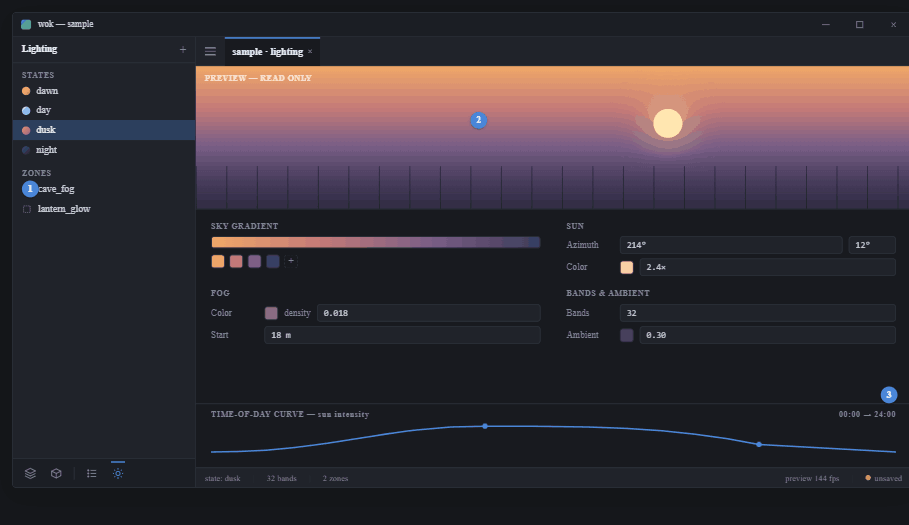
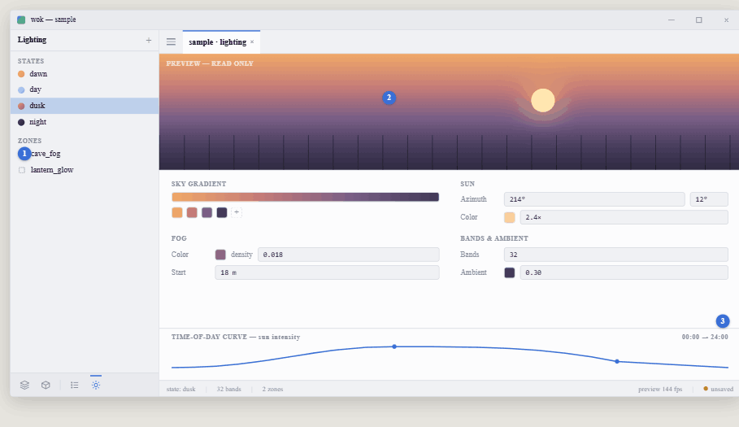

# View 6 — Lighting: states, sky, curves

**Roadmap step 7 · data context.** Shared rules and tokens:
[../README.md](../README.md).

## Purpose

Edit a lighting state. A **data context**: the 3D is a read-only preview, the
form is the authoring surface.

## Components

- **Lighting nav view** — STATES list (dawn / day / dusk / night, each a colour
  dot) + ZONES (placed fog / lighting volumes, dashed-box icons). Selecting a
  state loads it into the form; a `+` adds a state.
- **Preview strip** — a read-only 3D band (no camera control, no picking); shows
  the state being edited (wok-render sky + sun + fog + banded terrain). Label it
  `PREVIEW — READ ONLY`.
- **Param form** — a 2-column grid: SKY GRADIENT (a gradient bar + colour stops),
  SUN (azimuth / elevation `DragValue`s, colour, intensity), FOG (colour,
  density, start), BANDS & AMBIENT (band count, ambient colour + level). Colour
  fields are swatch buttons opening a picker.
- **Curve editor** — a compact time-of-day curve (sun intensity etc.) with
  draggable keys; not a full graph editor.
- **Status bar** — `state: dusk` · band count · zone count.

## Behaviour & actions

Every field writes `wok-light` through `action::handle`.

## Decision to settle here (parked in the canon)

Whether lighting states are a **shared project library** (by-name, current canon,
like prefabs) or **scene-owned**. Flag this to the user and settle it in this
view's brief — do not silently pick.
