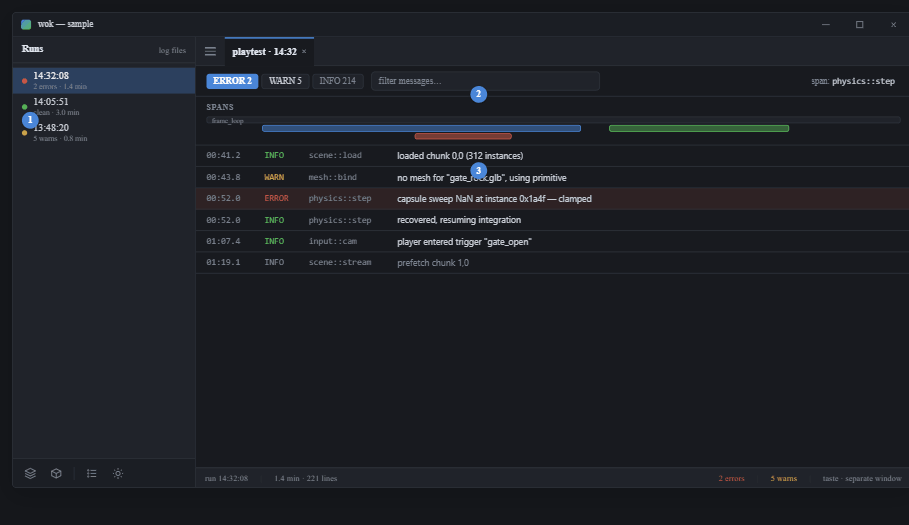
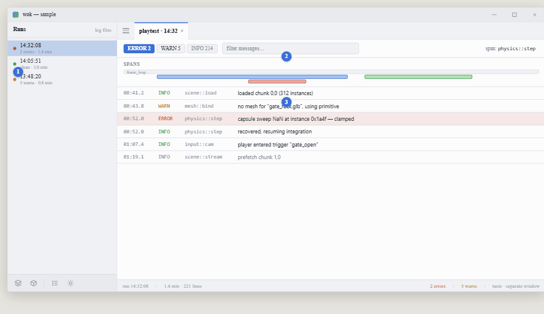

# View 7 — Playtest insight: log + trace explorer

**Roadmap step 8 · data context.** Shared rules and tokens:
[../README.md](../README.md).

## Purpose

Review a saved playtest run after the fact. **The one read-only view** — it
consumes a log file and authors nothing, so **there is no action layer here.**

## Components

- **Runs nav view** — list of past runs (timestamp, status dot:
  error / clean / warn, duration). Selecting one opens its tab. Run itself
  launches taste as a separate OS window (`cargo run`) and writes a log file;
  nothing is tailed live.
- **Filter bar** — level toggles with counts (ERROR / WARN / INFO), a text
  filter, and a current-span chip.
- **Span ribbon** — the tracing span tree as horizontal time bars; click a span
  to scope the log to it.
- **Log table** — monospace rows: time, level badge (colour-coded with the status
  colours), span target, message. Error rows tinted with the error colour at low
  alpha.
- **Status bar** — run timestamp · duration · line count; right: error / warn
  counts.

## Behaviour

Read-only. Parses the saved tracing log (structured by spans). No `Action`s, no
model mutation.
