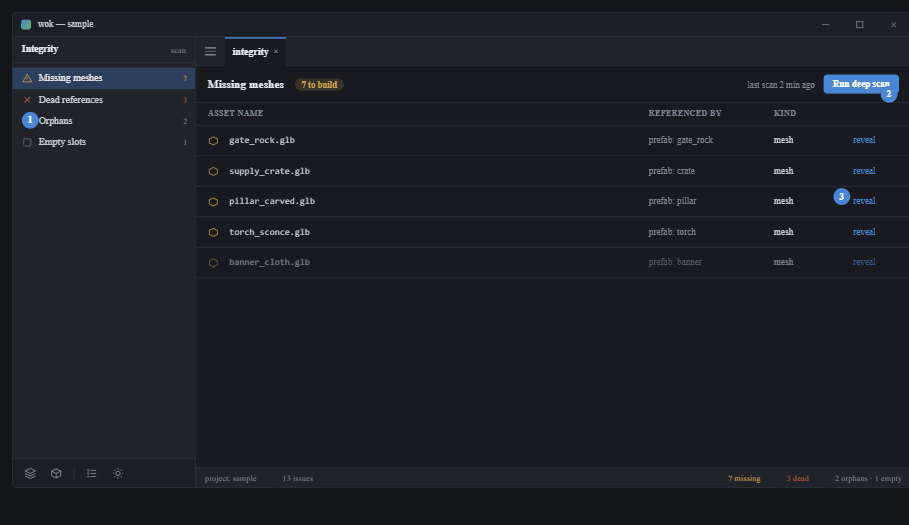
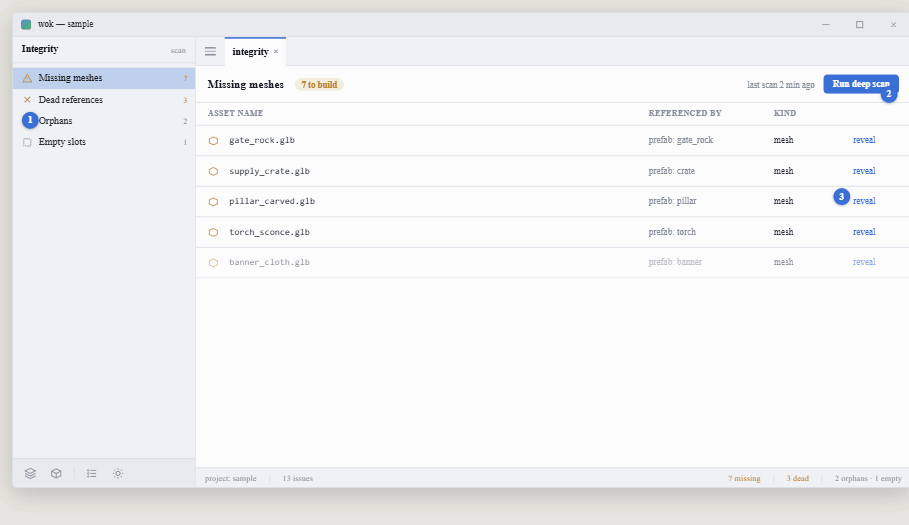

# View 8 — Integrity: missing-assets queue + scan

**Roadmap step 9 · data context.** Shared rules and tokens:
[../README.md](../README.md).

## Purpose

Surface content integrity. A **data context**; the editor *consumes* the scan
result (an engine concern), it does not own the rules.

## Components

- **Categories nav view** — Missing meshes (warn icon + count), Dead references
  (error), Orphans, Empty slots — each with a live count. Missing meshes is the
  artist's to-build queue; the rest are correctness checks. Selecting a category
  fills the list.
- **Header / scan bar** — category title + a count pill + `last scan …` + a
  **Run deep scan** button (accent).
- **Queue table** — columns: asset name (mono), referenced-by, kind, and a
  **reveal** affordance per row that jumps to source (opens the prefab / scene
  tab, selects the instance).
- **Status bar** — project · total issue count; right: per-category counts.

## Behaviour & actions

"Run deep scan" re-walks the project (dead refs, orphans). The missing-mesh list
falls out of name-binding resolution for free. Every row navigates to its source
(emits the open-tab + `Action::Select` the same way the nav tree does). The scan
rules themselves live in the engine — the editor only reads the result.
